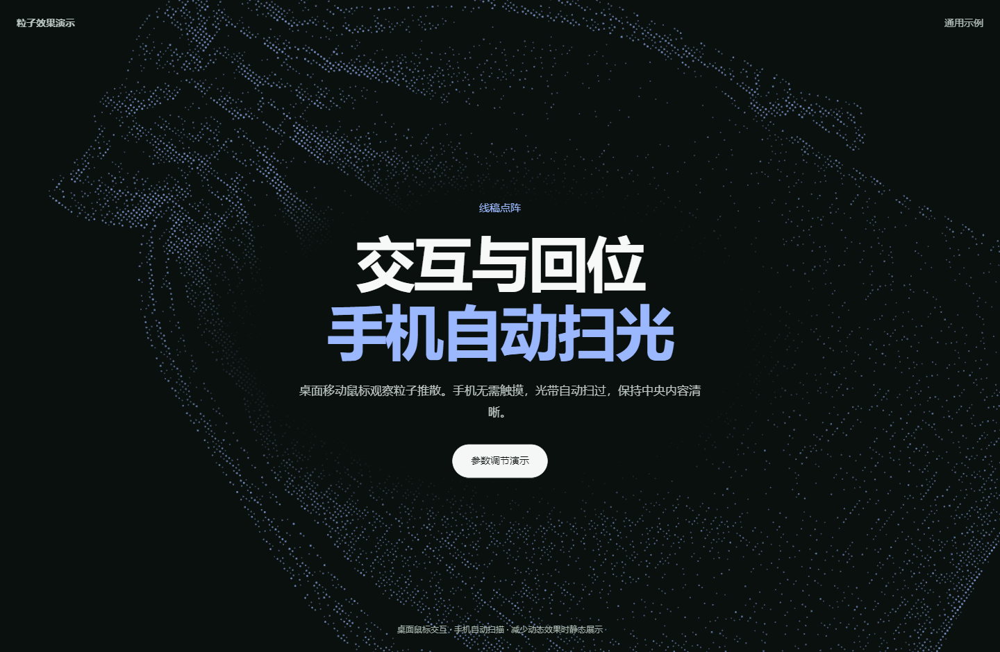

# Particle Hero Skill

[中文](#中文) | [English](#english)




## 中文

将线稿转换为粒子首页：桌面鼠标靠近时散开、提亮，离开后回位；手机无需触摸，自动扫光并恢复轮廓。

支持通过 Codex 技能接入现有项目。示例使用通用文案与无品牌素材，只展示首页。

### 安装技能

Windows / PowerShell：

```powershell
$skillDir = Join-Path $env:USERPROFILE '.codex\skills\particle-hero'
if (Test-Path -LiteralPath $skillDir) { throw '技能目录已存在，请先检查已有版本' }
git clone https://github.com/13inf/particle-hero-skill.git $skillDir
```

macOS / Linux：

```sh
git clone https://github.com/13inf/particle-hero-skill.git ~/.codex/skills/particle-hero
```

如果使用自定义 `CODEX_HOME`，安装到对应目录下的 `skills/particle-hero`。

安装后刷新技能列表，在目标项目中使用 `$particle-hero`，并附上接入要求。

### 提示词接入模式

#### 接入现有首页

打开你的项目，将下面的提示词发送给 Codex：

```text
使用 $particle-hero，为当前项目的首页接入线稿粒子效果。

先阅读现有代码，确认框架、首页入口和样式组织，再直接完成修改。

具体要求：
1. 保留现有导航、标题、正文和按钮，只调整接入效果所需的布局。
2. 使用技能附带的通用线稿，采用 diagonal 斜向构图。
3. 桌面端支持鼠标靠近时粒子推散、提亮，离开后自然回位。
4. 手机端使用最终自动扫光版本，无需触摸，扫光结束后恢复轮廓。
5. 粒子放在内容后方，避让中央文字，不遮挡按钮或影响点击。
6. 适配桌面和手机，支持减少动态效果设置，页面不可见时暂停动画。
7. 不增加效果观察、复现说明等展示区块，不在页面上显示技术说明文字。

完成后运行项目现有的必要检查，验证桌面和手机布局，
说明修改了哪些文件，以及哪些效果已经验证、哪些仍未验证。
```

#### 使用自己的线稿

将线稿加入项目，并把提示词中的路径替换为实际路径：

```text
使用 $particle-hero，将首页粒子素材替换为：
[填写线稿文件路径]

保留当前首页内容和配色，按线稿形状调整采样密度、尺寸与位置，
确保轮廓清晰，中央文字区域留有足够空间。

桌面端保留鼠标推散、提亮和回位。
手机端保留最终自动扫光，并根据屏幕尺寸控制粒子数量。

直接完成接入并检查效果；如果素材不适合粒子采样，
先说明具体问题，再提出必要的处理建议。
```

#### 生成独立演示

暂时没有项目时，可以先生成一个演示页面：

```text
使用 $particle-hero，生成一个可以在浏览器直接打开的单文件 HTML 演示。

使用技能附带的通用线稿和匿名示例文案，采用 diagonal 斜向构图。
页面只保留首页，包括标题、简短说明和一个主按钮。

桌面端支持鼠标推散、提亮和回位。
手机端使用最终自动扫光版本，无需触摸。

图片与运行所需代码内嵌，不依赖远程图片、字体或脚本。
不增加说明区块、参数面板或技术标签。

完成后检查桌面与手机布局，并告诉我生成文件的位置。
```

提示词中的构图可以替换为：

- `corner`：两角布袋与布纹。
- `weave`：两侧布纹。
- `diagonal`：斜向布袋，默认演示构图。

也可以补充自己的背景色、粒子颜色、线稿位置和文字留白要求。

### 许可证

[MIT](LICENSE)。

## English

Turn line art into a particle hero: on desktop, particles scatter and brighten near the pointer, then return as it moves away. On mobile, an automatic light sweep plays without touch input and restores the outline afterward.

Use this Codex skill to integrate the effect into an existing project. Examples use generic copy and unbranded assets, and show only the homepage hero.

### Install the skill

Windows / PowerShell:

```powershell
$skillDir = Join-Path $env:USERPROFILE '.codex\skills\particle-hero'
if (Test-Path -LiteralPath $skillDir) { throw 'The skill directory already exists. Check the installed version first.' }
git clone https://github.com/13inf/particle-hero-skill.git $skillDir
```

macOS / Linux:

```sh
git clone https://github.com/13inf/particle-hero-skill.git ~/.codex/skills/particle-hero
```

If you use a custom `CODEX_HOME`, install the repository under its `skills/particle-hero` directory.

After installation, refresh the skill list. In your target project, invoke `$particle-hero` and describe your integration requirements.

### Prompt-based integration

#### Integrate into an existing homepage

Open your project and send this prompt to Codex:

```text
Use $particle-hero to add a line-art particle effect to this project's homepage.

Read the existing code first to identify the framework, homepage entry point,
and styling structure, then implement the changes directly.

Requirements:
1. Preserve the existing navigation, headings, body text, and buttons.
   Adjust only the layout needed to integrate the effect.
2. Use the generic line art bundled with the skill and the diagonal composition.
3. On desktop, scatter and brighten particles near the pointer,
   then let them return naturally as the pointer moves away.
4. On mobile, use the final automatic sweep version. It must work without
   touch input and restore the outline after each sweep.
5. Place particles behind the content and keep the central text area clear.
   Do not obscure buttons or interfere with clicks.
6. Support desktop and mobile layouts, respect reduced-motion preferences,
   and pause animation when the page is not visible.
7. Do not add effect-observation or reproduction-guide sections,
   or display technical explanations on the page.

Run the project's relevant existing checks and verify desktop and mobile layouts.
Report the changed files and distinguish verified behavior from untested behavior.
```

#### Use your own line art

Add your line art to the project and replace the placeholder with its actual path:

```text
Use $particle-hero to replace the homepage particle artwork with:
[insert the line-art file path]

Preserve the current homepage content and colors. Adjust sampling density,
size, and position to suit the artwork, keeping its outline clear
and leaving enough space around the central text.

Keep pointer repulsion, highlighting, and return behavior on desktop.
Keep the final automatic sweep on mobile and control the particle count
according to screen size.

Implement the integration and check the result. If the artwork is unsuitable
for particle sampling, explain the specific issue first and suggest
the necessary preparation steps.
```

#### Generate a standalone demo

If you do not have a project yet, start with a demo page:

```text
Use $particle-hero to generate a single-file HTML demo
that can be opened directly in a browser.

Use the skill's bundled generic line art and anonymous example copy
with the diagonal composition. Show only a homepage hero containing
a heading, a short description, and one primary button.

On desktop, support pointer repulsion, highlighting, and return behavior.
On mobile, use the final automatic sweep version without requiring touch input.

Embed the images and runtime code. Do not depend on remote images,
fonts, or scripts. Do not add explanation sections, parameter panels,
or technical labels.

Check desktop and mobile layouts and report the generated file's location.
```

You can replace the composition in these prompts with:

- `corner`: bags and fabric textures in two corners.
- `weave`: fabric textures on both sides.
- `diagonal`: a diagonally positioned bag, used in the default demo.

You can also specify the background color, particle color, artwork position, and space around the text.

### License

[MIT](LICENSE).
